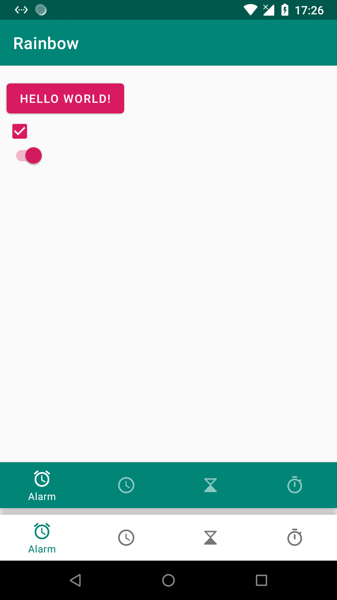
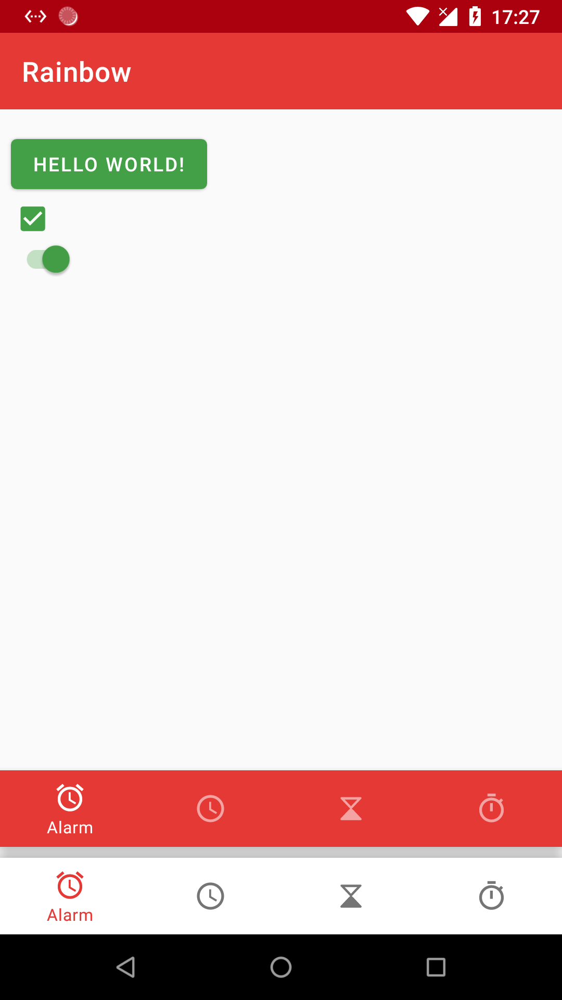
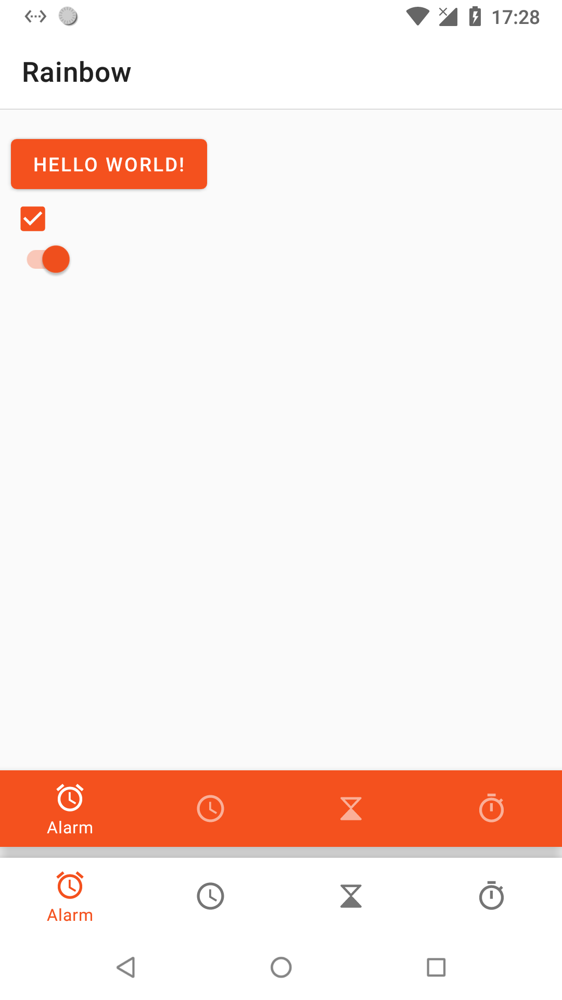
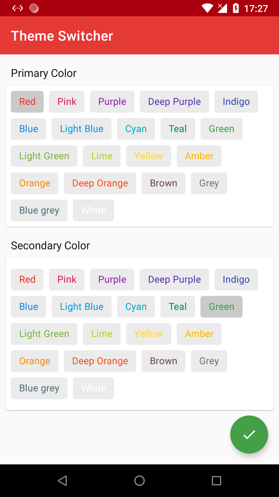

# Rainbow

[](https://jitpack.io/#cn.quickits/Rainbow)

🏳️‍🌈 Rainbow is a color theme library for Android

## Sample

|                             |                             |                             |
| :-------------------------: | :-------------------------: | :-------------------------: |
|  |  |  |
|  |

## Download

- Add it in your root build.gradle at the end of repositories:

```
allprojects {
    repositories {
        maven { url 'https://jitpack.io' }
    }
}
```

- Add the dependency

```
dependencies {
    implementation 'cn.quickits:Rainbow:x.y.z'
}
```

## Usage

### Setup your app theme, extends `Theme.Rainbow.Light.NoActionBar`

```xml
<style name="AppTheme" parent="Theme.Rainbow.Light.NoActionBar">

</style>
```

### Init theme

```kotlin
class MainApplication : Application() {

    override fun onCreate() {
        super.onCreate()
        Rainbow.initThemeOverlays(
            this,
            R.style.ThemeOverlay_PrimaryPalette_White,
            R.style.ThemeOverlay_SecondaryPalette_Brown
        )
    }
}
```

### Apply theme

```kotlin
class MainActivity : AppCompatActivity() {

    override fun onCreate(savedInstanceState: Bundle?) {
        Rainbow.applyThemeOverlays(this) // apply theme
        super.onCreate(savedInstanceState)
        setContentView(R.layout.activity_main)
    }

}
```

### Theme switcher

* Option 1, Open `ThemeSwitcherFragment`
* Option 2, Call `Rainbow.setupThemeOverlays(activity, pramery, sencondary)`

### Advance [Optional]

* Custom theme palette

`Primary` need extends `ThemeOverlay.PrimaryPalette`

```xml
<style name="Your Theme" parent="ThemeOverlay.PrimaryPalette">
    <item name="colorPrimary">#e53935</item>
    <item name="colorPrimaryDark">#ab000d</item>
    <item name="toolbarStyle">@style/Widget.Rainbow.Toolbar.Dark</item>
    <!-- your others -->
</style>
```

`Secondary` need extends `ThemeOverlay.SecondaryPalette`

```xml
<style name="Your Theme" parent="ThemeOverlay.SecondaryPalette">
    <item name="colorAccent">#8e24aa</item>
    <!-- your others -->
</style>
```

* Setup light status bar or navigation bar

```xml
<style name="Your Theme" parent="ThemeOverlay.PrimaryPalette">
    <item name="isLightStatusBar">false</item>
    <item name="isLightNavigationBar">false</item>
    ...
</style>
```

## Licence

Apache License Version 2.0

Copyright (c) 2019-present, Quickits.CN
